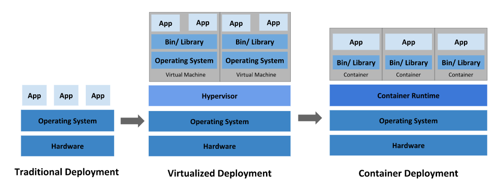
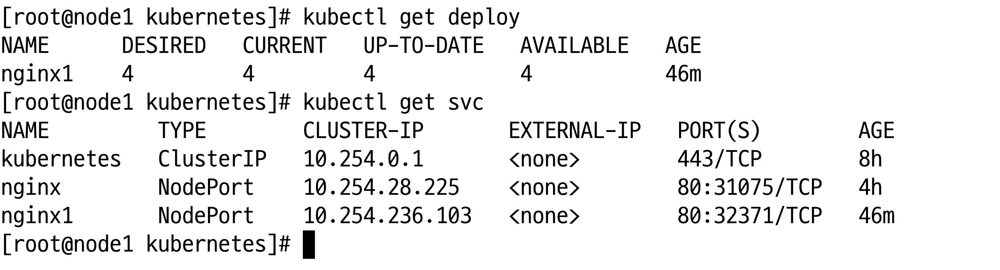
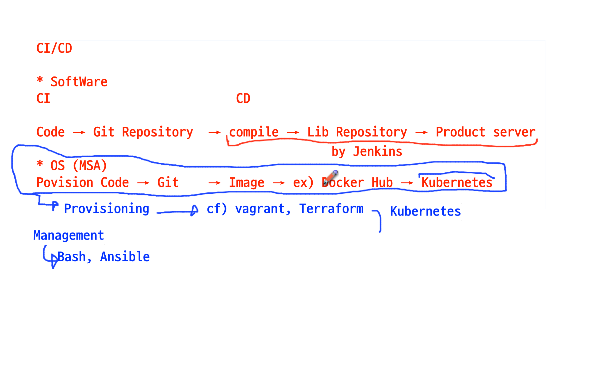
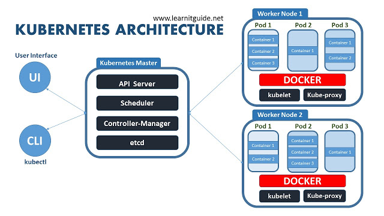
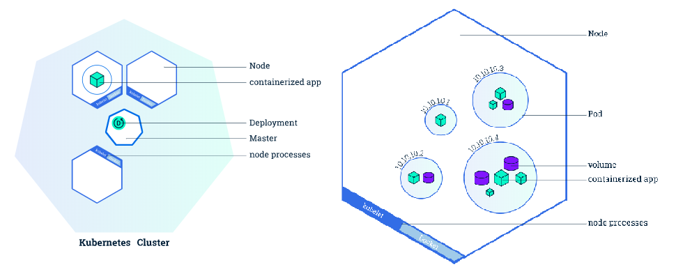
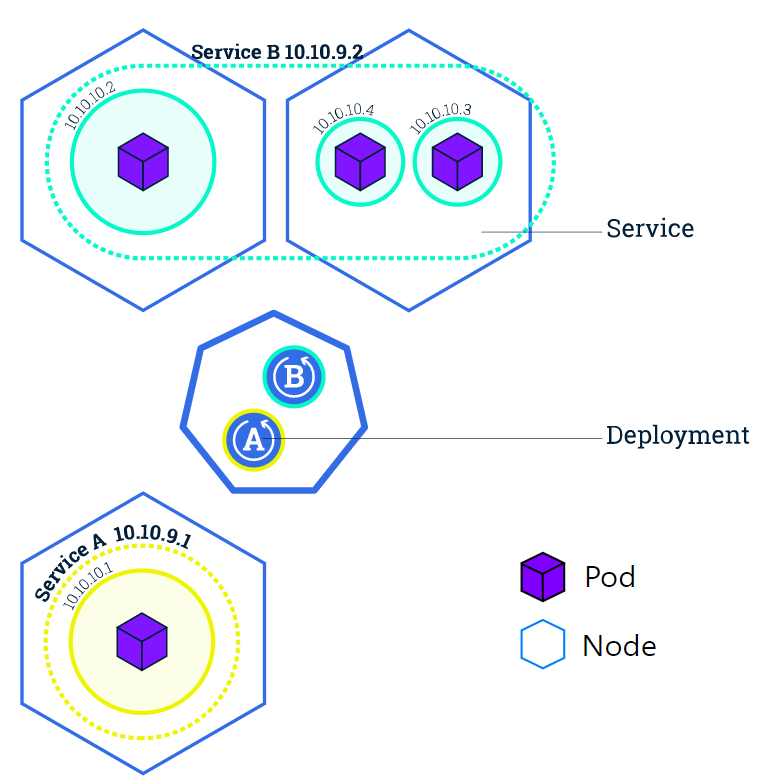
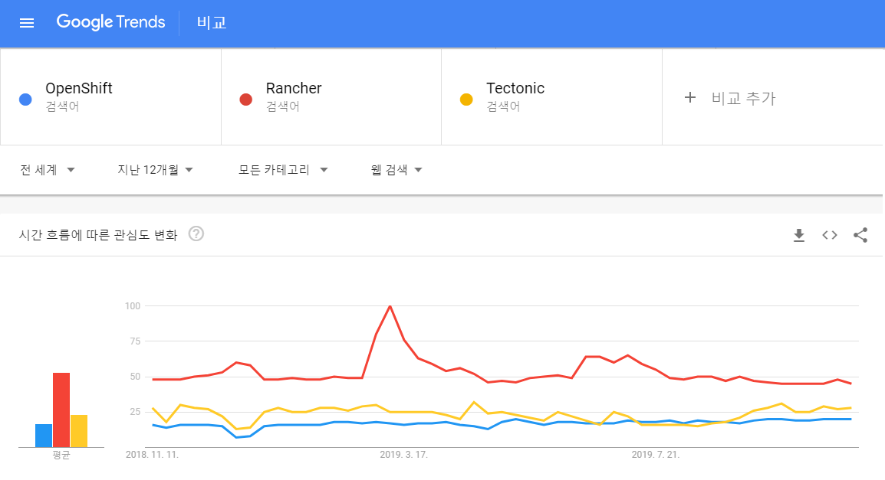
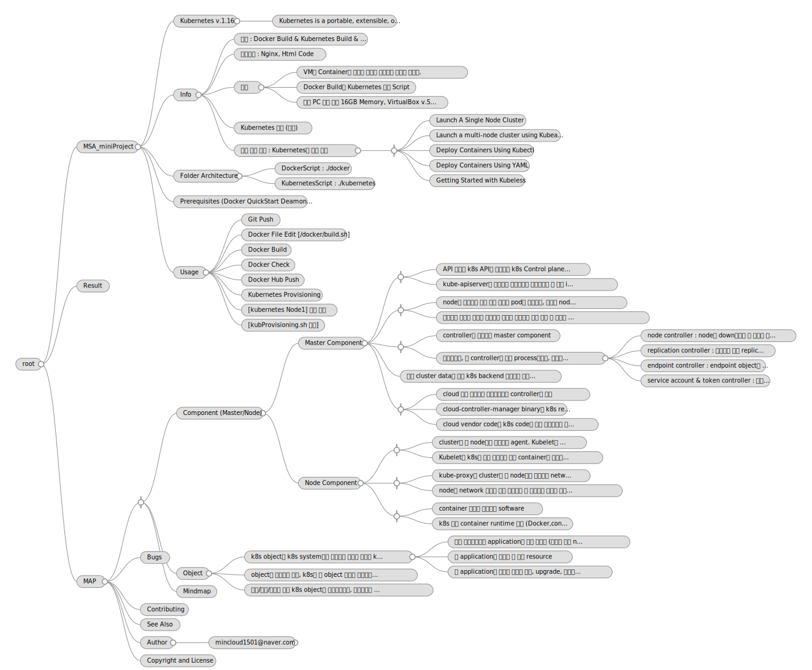

# MSA_miniProject
Micro Service Architecture mini Project using Kubernetes

☞ 하기 모든 내용의 출처는 [](https://kubernetes.io/ko/docs/home/)



- `Traditional Deployment`: 애플리케이션을 물리 서버에서 실행하여 리소스 할당의 문제가 발생, 다른 애플리케이션의 성능이 저하 발생, 서로 다른 여러 물리 서버에서 각 애플리케이션을 실행하여 해결하려 했으나 리소스가 충분히 활용되지 않는다는 점에서 확장 가능하지 않고, 물리 서버를 많이 유지하기 위해서 조직에게 많은 비용이 발생

- `Virtualized Deployment` : 가상화가 도입되어 단일 물리 서버의 CPU에서 여러 가상 시스템(VM)을 실행할 수 있게 하여 VM간에 애플리케이션을 격리하고 애플리케이션의 정보를 다른 애플리케이션에서 자유롭게 액세스 할 수 없게 일정 수준의 보안성을 제공, 물리 서버에서 리소스를 보다 효율적으로 활용할 수 있으며, 쉽게 애플리케이션을 추가하거나 업데이트할 수 있고 하드웨어 비용을 절감할 수 있어 더 나은 확장성을 제공

- `Container Deployment` : 컨테이너는 VM과 유사하지만 격리 속성을 완화하여 애플리케이션 간에 운영체제(OS)를 공유한다. VM과 마찬가지로 컨테이너에는 자체 파일 시스템, CPU, 메모리, 프로세스 공간 등이 있고 기본 인프라와의 종속성을 끊었기 때문에, 클라우드나 OS 배포본에 모두 이식 가능

## Kubernetes Component

- 쿠버네티스를 배포하면 Cluster가 생기는데 컨테이너화된 애플리케이션을 실행하는 `Node`라고 하는 워커 머신의 집합으로 모든 클러스터는 최소 한 개의 워커 노드를 가진다.
- 워커 노드는 애플리케이션의 구성요소인 Pod를 host 하는데, Control Plane은 워커 노드와 클러스터 내 파드를 관리한다. 


#### ■ Control Plane Component

- 클러스터에 관한 전반적인 결정(스케줄링)을 수행하고 클러스터 이벤트를 감지하고 반응한다.
- 클러스터 내 어떠한 머신에서든지 동작할 수 있지만 간결성을 위하여, 구성 스크립트는 보통 동일 머신 상에 모든 컨트롤 플레인 컴포넌트를 구동시키고, 사용자 컨테이너는 해당 머신 상에 동작시키지 않는다.

`kube-apiserver`
- API 서버는 쿠버네티스 API를 노출하는 쿠버네티스 컨트롤 플레인 컴포넌트로 쿠버네티스 컨트롤 플레인의 프론트 엔드이다.
- kube-apiserver는 수평으로 확장되도록 디자인되어, 더 많은 인스턴스를 배포해서 확장할 수 있다. 여러 kube-apiserver 인스턴스를 실행하고, 인스턴스간의 트래픽을 균형있게 조절할 수 있다.

`etcd`
- 모든 클러스터 데이터를 담는 쿠버네티스 뒷 단의 저장소로 사용되는 일관성·고가용성 키-값 저장소.

`kube-scheduler`
- 노드가 배정되지 않은 새로 생성된 파드를 감지하고, 실행할 노드를 선택하는 컨트롤 플레인 컴포넌트.

`kube-controller-manager`
- 컨트롤러를 구동하는 마스터 상의 컴포넌트로 각 컨트롤러는 개별 프로세스이지만, 복잡성을 낮추기 위해 모두 단일 바이너리로 컴파일되고 단일 프로세스 내에서 실행
	- `node controller` : 노드가 다운되었을 때 통지와 대응에 관한 책임을 가진다.
	- `replication controller` : 시스템의 모든 레플리케이션 컨트롤러 오브젝트에 대해 알맞은 수의 파드들을 유지시켜 주는 책임을 가진다.
	- `end-point controller` : 엔드포인트 오브젝트를 채운다(즉, 서비스와 파드를 연결시킨다.)
	- `service account & token controller` : 새로운 네임스페이스에 대한 기본 계정과 API 접근 토큰을 생성한다.

`cloud-controller-manager`
- 클라우드별 컨트롤 로직을 포함하는 쿠버네티스 컨트롤 플레인 컴포넌트로 클러스터를 클라우드 공급자의 API에 연결하고, 해당 클라우드 플랫폼과 상호 작용하는 컴포넌트와 클러스터와 상호 작용하는 컴포넌트를 분리할 수 있다.

#### ■ Node Component

- 동작 중인 파드를 유지시키고 쿠버네티스 런타임 환경을 제공하며, 모든 노드 상에서 동작한다.

`kubelet`
- 클러스터의 각 노드에서 실행되는 agent로 Kubelet은 파드에서 컨테이너가 확실하게 동작하도록 관리
- 다양한 메커니즘을 통해 제공된 PodSpec의 집합을 받아서 컨테이너가 해당 파드스펙에 따라 동작하도록 하며, 쿠버네티스를 통해 생성되지 않는 컨테이너는 관리하지 않는다

`kube-proxy`
- 클러스터의 각 노드에서 실행되는 네트워크 proxy로, 서비스 개념의 구현부이며 노드의 네트워크 규칙을 유지 관리
- 네트워크 규칙이 내부 네트워크 세션이나 클러스터 바깥에서 파드로 네트워크 통신 가능토록 함

`Container Runtime`
- 컨테이너 실행을 담당하는 소프트웨어로 쿠버네티스는 여러 컨테이너 런타임을 지원
- Docker, containerd, CRI-O & Kubernetes CRI를 구현한 모든 소프트웨어

#### ■ AddOn

- 쿠버네티스 리소스(daemonset, deployment 등)를 이용하여 클러스터 기능을 구현하며, 클러스터 단위의 기능을 제공하기 때문에 애드온에 대한 네임스페이스 리소스는 kube-system 네임스페이스에 속한다.

`DNS`
- 모든 쿠버네티스 클러스터는 클러스터 DNS를 갖추어야만 한다.쿠버네티스 서비스를 위해 DNS 레코드를 제공해주는 DNS 서버다.
- 쿠버네티스에 의해 구동되는 컨테이너는 DNS 검색에서 이 DNS 서버를 자동으로 포함한다.

`Web UI(Dashboard)`
- 대시보드는 쿠버네티스 클러스터를 위한 범용의 웹 기반 UI로 사용자가 클러스터 자체뿐만 아니라, 클러스터에서 동작하는 애플리케이션에 대한 관리와 문제 해결을 할 수 있도록 해준다.

`Container Resource Monitoring`
- 컨테이너 리소스 모니터링은 중앙 데이터베이스 내의 컨테이너들에 대한 포괄적인 시계열 매트릭스를 기록하고 그 데이터를 열람하기 위한 UI를 제공

`Cluster-Level Logging`
- 클러스터-레벨 로깅 메커니즘은 검색/열람 인터페이스와 함께 중앙 로그 저장소에 컨테이너 로그를 저장하는 책임

## Kubernetes v.1.16
- Kubernetes is a portable, extensible, open-source platform for managing containerized workloads(Pods, Replicaset..) and services. (쿠버네티스는 컨테이너화된 워크로드와 서비스를 관리하기 위한 이식성이 있고, 확장가능한 오픈소스 플랫폼이다.)
- application을 배포하기 위해 desired state를 다양한 object에 라벨Label을 붙여 정의(yaml)하고 API 서버에 전달하는 방식을 사용
- kube는 Deployment, StatefulSets, DaemonSet, Job, CronJob등 다양한 배포 방식을 지원

---

[Kubernetes Architecture & Ecosystem] [](https://www.learnitguide.net/2018/08/what-is-kubernetes-learn-kubernetes.html) [](https://www.magalix.com/blog/kubernetes-101-concepts-and-why-it-matters)


## Info
- 목적 : Docker Build & Kubernetes Build & Provisioning
- 구성요소 : Nginx, Html Code
- 요건
	- VM과 Container의 개념을 정확히 이해하고 있어야 합니다.
	- Docker Build와 Kubernetes 배포 Script
	- 개인 PC 사양 최소 16GB Memory, VirtualBox v.5.2.20 or later
- Kubernetes 환경 (출처)
<div><a href="https://github.com/rootsongjc/kubernetes-vagrant-centos-cluster.git"></a></div>

- 사전 준비 사항 : Kubernetes에 대한 이해
	- [](https://kubernetes.io/ko/docs/home/)
	- [](https://www.katacoda.com/courses/kubernetes)
		- Launch A Single Node Cluster
		- Launch a multi-node cluster using Kubeadm
		- Deploy Containers Using Kubectl
		- Deploy Containers Using YAML
		- Getting Started with Kubeless
		-...

## Folder Architecture
* DockerScript : ./docker
* KubernetesScript : ./kubernetes

## Prerequisites (Docker QuickStart Deamon에서 실행)

```bash
$ cd ~/MSA_miniProject
$ mdir docker
$ mkdir kubernetes
$ touch docker/build.sh
$ touch docker/push.sh
$ touch kubernetes/kubProvisioning.sh
$ git config --global user.name "mincloud1501"
$ git config --global user.email "mincloud1501@naver.com"
$ cat .git/config
```

## Usage
* Git Push

```bash
$ git add -A
$ git commit -m "first"	// Local Repository
$ git push // Remote Repository
```

* Docker File Edit [/docker/build.sh]

```bash
docker build --rm -t mincloud1501/nginx .
docker run -d --rm --name nginx1 -p 8888:80 mincloud1501/nginx
```
* Docker Build

```bash
cd ./docker
. build.sh
```
* Docker Check

```bash
$ docker images
REPOSITORY           TAG                 IMAGE ID            CREATED             SIZE
mincloud1501/nginx   latest              40f4b6da1e0f        24 seconds ago      109MB

$ docker ps -a
CONTAINER ID        IMAGE                COMMAND                  CREATED             STATUS              PORTS                  NAMES
b9c7b72516dc        mincloud1501/nginx   "nginx -g 'daemon of…"   7 seconds ago       Up 7 seconds        0.0.0.0:8888->80/tcp   nginx1

$ docker-machine ip
192.168.99.100
```

[Test Page Connection]

*http://docker-machine-ip:8888*

* Docker Hub Push

```bash
. push.sh
```

* Kubernetes Provisioning

- [kubernetes Node1] 에서 실행

```bash
[root@node1 ~]# kubectl delete deploy/nginx1; kubectl run nginx1 --image=mincloud1501/nginx --port=80 -o yaml > deploy.yaml

[root@node1 ~]# kubectl create -f deploy.yaml 로 확인
```

```bash
[root@node1 ~]# kubectl expose deployment/nginx1 --type="NodePort" --port 80 -o yaml > sevice.yaml
```

- [kubProvisioning.sh 편집]

```bash
#!/bin/bash

kubectl delete deploy/nginx1
kubectl create -f ./deploy.yaml

kubectl delete svc/nginx1
kubectl create -f ./service.yaml
```

[kubProvisioning.sh 실행]

```bash
[root@node1 ~]#. kubProvisioning.sh
```

# Result


# MAP


---

### Component (Master/Node)



#### Master Component

`kube-apiserver`

- API 서버는 k8s API를 노출하는 k8s Control plane component의 Frontend
- kube-apiserver는 수평으로 확장되도록 디자인되어 더 많은 instance를 배포해서 확장/실행/인스턴스간 트래픽을 조절 기능

`kube-scheduler`

- node가 배정되지 않은 새로 생성된 pod를 감지하고, 구동될 node를 선택하는 master component
- 스케줄링 결정을 위해서 고려되는 요소는 리소스에 대한 개별 및 총체적 요구 사항, 하드웨어/소프트웨어/정책적 제약, affinity 및 anti-affinity 명세, 데이터 지역성, 워크로드-간 간섭, 데드라인을 포함

`kube-controller-manager`

- controller를 구동하는 master component
- 논리적으로, 각 controller는 개별 process이지만, 복잡성을 낮추기 위해 모두 단일 binary로 compile되고 단일 process 내에서 실행
	- node controller : node가 down되었을 때 통지와 대응에 관한 책임
	- replication controller : 시스템의 모든 replication controller object에 대해 알맞는 수의 pod들을 유지
	- endpoint controller : endpoint object를 채운다 (service와 pod를 연결)
	- service account & token controller : 새로운 namespace에 대한 기본 계정과 API access token을 생성

`etcd`

- 모든 cluster data를 담는 k8s backend 저장소로 사용되는 일관성·고가용성 key-value 저장소

`cloud-controller-manager`

- cloud 제공 사업자와 상호작용하는 controller를 작동
- cloud-controller-manager binary는 k8s release 1.6에서 도입된 alpha 기능
- cloud vendor code와 k8s code가 서로 독립적으로 발전시켜 나갈 수 있도록 해준다.

#### Node Component

`kubelet`

- cluster의 각 node에서 실행되는 agent. Kubelet은 pod에서 container가 확실하게 동작하도록 관리
- Kubelet은 k8s를 통해 생성되지 않는 container는 관리하지 않는다.

`kube-proxy`

- kube-proxy는 cluster의 각 node에서 실행되는 network proxy로, k8s의 service 개념의 구현부
- node의 network 규칙을 유지 관리하며 이 네트워크 규칙이 내부 network session이나 cluster 외부에서 pod로 network 통신을 할 수 있도록 해준다.

`container runtime`

- container 실행을 담당하는 software
- k8s 여러 container runtime 지원 (Docker,containerd,cri-o,rktlet,Kubernetes CRI를 구현한 모든 software)





---

### Object

- k8s object는 k8s system에서 영속성을 가지는 개체로 k8s는 cluster의 status를 관리하기 위해 object를 이용 (Pod/ReplicaSet
/Service/Volume)
	- 어떤 컨테이너화된 application이 동작 중인지 (그리고 어느 node에서 동작 중인지)
	- 그 application이 이용할 수 있는 resource
	- 그 application이 어떻게 재구동 정책, upgrade, 그리고 내고장성과 같은 것에 동작해야 하는지에 대한 정책

- object를 생성하게 되면, k8s는 그 object 생성을 보장하기 위해 지속적으로 작동
- 생성/수정/삭제를 위해 k8s object를 동작시키려면, 쿠버네티스 API를 이용해야 한다. kubectl CLI를 이용할 때, 필요한 k8s API를 호출

[k8s deployment를 위한 Object Spec - YAML]

```yaml
apiVersion: apps/v1 # apps/v1beta2를 사용하는 1.9.0보다 더 이전의 버전용
kind: Deployment
metadata:
  name: nginx-deployment
spec:
  selector:
    matchLabels:
      app: nginx
  replicas: 2 # 템플릿에 매칭되는 파드 2개를 구동하는 디플로이먼트임
  template:
    metadata:
      labels:
        app: nginx
    spec:
      containers:
      - name: nginx
        image: nginx:1.7.9
        ports:
        - containerPort: 80
```

---

### Management Platform

Docker 및 k8s cluster를 배포 관리할 수 있는 플랫폼들을 알아보자.

- Rancher 2.0, OpenShift(Red Hat), Tectonic(CoreOS), Docker Enterprise Edition 등
- Service Mesh(Istio, linkerd), CI(Tekton, Spinnaker), Container Serverless(Knative), Machine Learning(kubeflow)이 모두 kube 환경

[평가 요소]

- k8s cluster의 provisioning
- 고가용성 및 복구
- 지원되는 배포 model
- 필수 구성 요소 및 운영 체제 요구 사항
- monitoring 및 운영 관리
- multi-cluster 관리 등

#### RHOCP (Red Hat OpenShift Container Platform)
- 순수 Open Source Model
- Enterprise `지원 관점`에서 OpenShift는 Rancher보다 약 5배 비쌈
- Red Hat OS에 국한되며 Windows를 지원하지 않음
- Docker Image의 전체 Life-cycle를 관리

#### Pivotal Cloud Foundry (PCF)
- PAS (Pivotal Application Service) & Pivotal Container Service (PKS)로 구성
- `Ubuntu에서만 실행`되며 값 비싼 모델이라 기업에 친숙하지 않은 가격 Model
- Open-Core Model, Microsoft Windows Server를 지원
- 개발자가 사전 개발된 Docker Image를 맞춤 개발하여 registry에서 배포 가능
- Spring Boot 및 Spring Cloud를 사용하는 12팩터 응용 프로그램을 제공

#### Rancher v.2.0 [](https://rancher.com)
- Linux host, docker container, k8s node 위에서 위치나 인프라와 관계 없이 관리하며, Amazon EKS, Google k8s engine, Azure container service, 기타 서비스로서의 k8s cloud에서 k8s cluster 관리 가능

#### CoreOS Tectonic
- container 중심의 linux 배포판과 enterprise급 k8s 배포판을 제공. 이 두 개가 합쳐진 것이 Tectonic stack의 기반을 형성
- CoreOS 운영 체제인 `Container Linux`는 콘테이너화된 구성요소의 모음으로 제공된다는 점에서 차별점을 지닌다.
- 실행 중인 애플리케이션을 중단할 필요 없이, OS에 대한 자동화된 업데이트를 가능하게 해 준다.

#### Platform9 Managed k8s
- 다양한 환경(Local baremetal, 원격 public cloud 등)에서도 실행되지만, 플랫폼9의 서비스 형태로 원격 관리
- 플랫폼9는 매니지드 쿠버네티스에 대한 업데이트를 약 6주에 한번씩 고객 감시 하에 내보낸다.
- Severless Compute 또는 FaaS라고도 하는데 거의 대부분의 프로그래밍 언어와 콘테이너화된 런타임으로 작동된다.



### ★ Considerations

- k8s cluster에 Deployment를 배포하고 Ingress를 연결하자. Nginx말고 Traefik Ingress도 좋다던데?
- AWS에 설치할 땐 kops(Kubernetes Operations)가 좋고, 요즘엔 Amazon EKS(Elastic Kubernetes Service)도 선호?
- on-premise에 설치할 때, kubespray / kubeadm / rancher / openshift 중에 뭐가 좋을까?
- k8s에 istio나 linkerd 설치해서 service mesh 적용하고 zipkin으로 추적하자!
- Container Serverless Cloud Run이 Knative 기반이라던데?
- Container build, 배포는 Spinnaker나 Jenkins X (Jenkins와는 다름!) 써볼까?
- 설정 파일은 helm으로 만들고, ChartMuseum으로 관리하자!
- cluster 하나는 불안한데...? multi-cluster 구성해야 하지 않을까? Anthos?
- Cloud Native Application 만들어서 k8s에 배포하자!

---

### Mindmap



---

## Bugs

Please report bugs to mincloud1501@naver.com

## Contributing

The github repository is at https://github.com/mincloud1501/MSA_miniProject.git

## See Also

Some other stuff.

## Author

J.Ho Moon, <mincloud1501@naver.com>

## Copyright and License

(c) Copyright 1997~2019 by SKB Co. LTD
