# MSA_miniProject
Micro Service Architecture mini Project using Kubernetes

## Docker [](https://www.linkedin.com/pulse/docker-kubernetes-security-principles-practices-dr-rabi-prasad-padhy)

- Kubernetes(이하 k8s)에 대해 알아보기 전, Docker에 대해 간단히 정리해 보자.
- Docker란, `컨테이너 기반의 오픈소스 가상화 플랫폼`이다.

[Docker Client-Server Architecture] [](https://docs.docker.com/get-started/overview/)


- Docker Client와 Docker Server로 나뉘어있고 그 사이에 REST API로 소통을 한다. 결국 client는 요청을 할뿐 build, run, push등은 실질적인 작업은 다 데몬(server)이 수행한다.

### Container [](https://pt.slideshare.net/insideHPC/linux-container-technology-101/3)

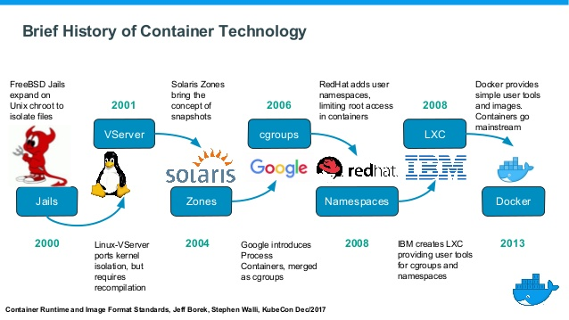

- Container는 격리된 공간에서 process가 동작하는 기술로 가상화 기술의 하나이지만 기존방식과는 차이가 있다.
- 기존의 가상화 방식은 주로 OS를 가상화하였다. VMware/VirtualBox 같은 VM은 Host OS위에 Guest OS 전체를 가상화하여 사용하는 방식으로 무겁고 느려서 운영환경에선 사용할 수 없다.
- 이러한 상황을 개선하기 위해 CPU의 가상화 기술(HVM)을 이용한 KVMKernel-based Virtual Machine과 `반가상화(Paravirtualization)` 방식의 Xen이 등장.
- Guest OS가 필요하긴 하지만 전체 OS를 가상화하는 방식이 아니기 때문에, 호스트형 가상화 방식에 비해 성능이 향상되어 OpenStack, AWS, Rackspace와 같은 Cloud Service에서 가상 컴퓨팅 기술의 기반이 되게 된다.

- 전가상화든 반가상화든 추가적인 OS를 설치하여 가상화하는 방법은 성능문제가 있어 이를 개선하기 위해 프로세스를 격리하는 방식이 등장함.
- Linux에서는 이 방식을 `Linux Container`라하고 단순히 프로세스를 격리시키기 때문에 가볍고 빠르게 동작한다.
- CPU나 Memory는 Process가 필요한 만큼만 추가로 사용하고, 성능적으로도 거의 손실이 없다.

- docker가 등장하기 전에, process를 격리하는 방법으로 리눅스에서 `cgroupscontrol groups`과 `namespace`를 이용한 `LXCLinux container`가 있었고, FreeBSD의 Jail, Solaris의 Solaris Zones이라는 기술이 있었다.
- Docker는 LXC를 기반으로 시작해서 0.9버전에서는 자체적인 libcontainer 기술을 사용하였고, 추후 runC기술에 합쳐지게 된다.

[Namespace]

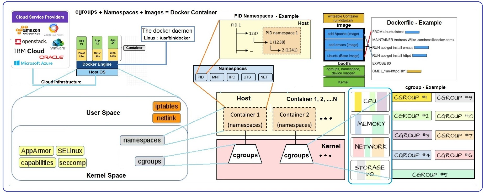

- Namespace는 container에 경량 프로세스 가상화를 제공하는 Kernel 기능으로, docker가 container에 대해 resource(process ID, host name, user ID, network access, IPC, file system)를 분리하는 데 도움이 된다.
- Namespace 밖에 있는 모든 것을 숨기는 process에 "view" 기능을 제공할 수 있게 해주므로, 프로세스가 다른 프로세스를 보거나 간섭할 수 없는 고유한 환경을 제공한다.

[Docker Container]

- Docker Image에서 시작된 Docker Container는 OS, User-added files, Meta-data로 구성된다. docker container가 실행되면 image 위에 read-write layer가 추가된다.

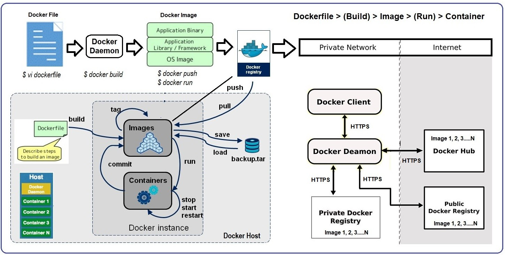

### Image


- Image는 Container 실행에 필요한 파일과 설정 값등을 포함하고 있는 것으로 상태값을 가지지 않고 변하지 않는다(`Immutable`).
- Container는 Image를 실행한 상태라고 볼 수 있고, 추가되거나 변하는 값은 container에 저장된다.
- 같은 image에서 여러 개의 container를 생성할 수 있고, container의 상태가 바뀌거나 삭제되어도 image는 변하지 않고 그대로 남아있다.

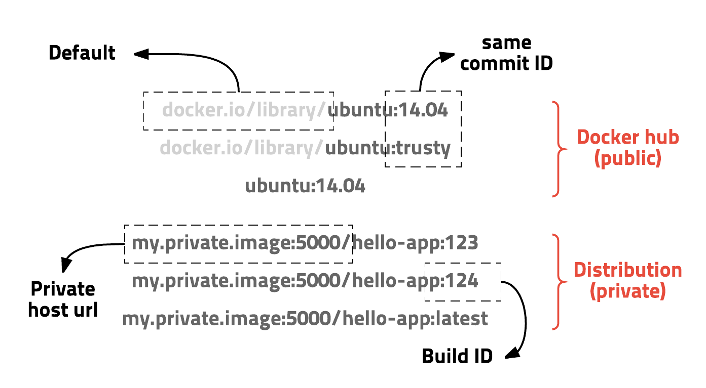

- Image는 url방식으로 관리하며 태그를 붙일 수 있다. ubuntu 14.04 이미지는 docker.io/library/ubuntu:14.04 또는 docker.io/library/ubuntu:trusty 이고 docker.io/library는 생략 가능하여 ubuntu:14.04로 사용할 수 있으며, tag 기능을 잘 이용하여 test나 rollback 쉽게 할 수 있다.

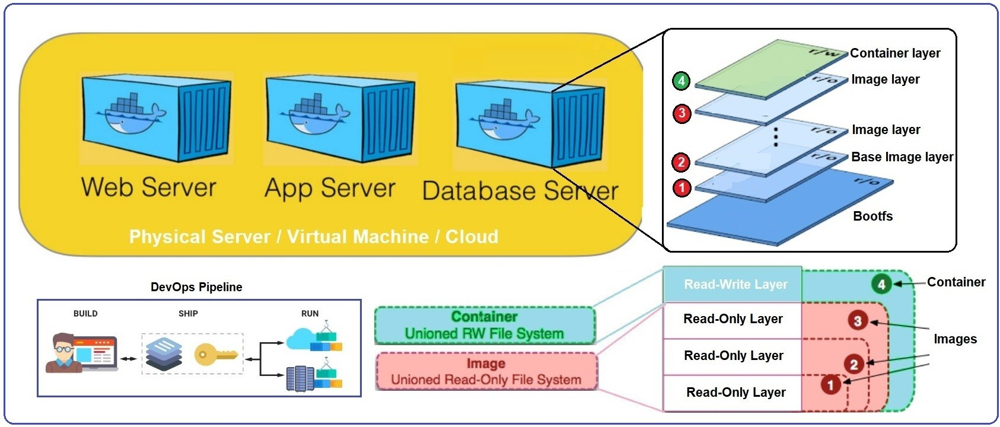

- Docker Image는 Docker Hub [](https://hub.docker.com)에 등록하거나 Docker Registry 저장소 [](https://docs.docker.com/registry/)를 직접 만들어 관리할 수 있다.
- Registry는 Docker Client가 repository에서 image를 얻기 위해 사용하는 `Repository + Index+Access Contriol Rule + API`의 집합이다. 주요 container registry로는 Docker Hub, ECR , JFrog 아티팩트 저장소, Google Container Registry 등이 있다.


### Layer


- Docker Image는 Container를 실행하기 위한 모든 정보를 가지고 있기 때문에, 보통 용량이 수백MB로 다시 다운받을 시 매우 비효율적일 수 밖에 없다.
- 이런 문제를 해결하기 위해 `Layer`라는 개념을 사용하고 Union File System을 이용하여 여러 개의 레이어를 하나의 Filesystem으로 사용할 수 있게 해준다.
- Container를 생성할 때도 Layer 방식을 사용하는데, 기존의 image layer 위에 read-write layer를 추가한다. image layer를 그대로 사용하면서 container가 실행 중에 생성하는 파일이나 변경된 내용은 read-write layer에 저장되므로, 여러 개의 container를 생성해도 최소한의 용량만 사용하게 된다.

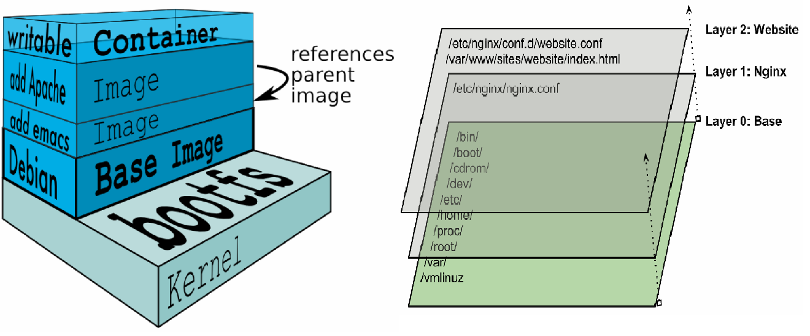


### Dockerfile

- Docker는 image를 만들기 위해 Dockerfile에 자체 DSLDomain-Specific Language를 이용하여 이미지 생성 과정을 기술한다.(선언한다)
- 서버에 어떤 프로그램을 설치하려고 여러 의존성 패키지를 설치하고 설정파일을 만들지 않고, Dockerfile로 관리하면 된다.


```bash
# vertx/vertx3 debian version
FROM subicura/vertx3:3.3.1
MAINTAINER chungsub.kim@purpleworks.co.kr

ADD build/distributions/app-3.3.1.tar /
ADD config.template.json /app-3.3.1/bin/config.json
ADD docker/script/start.sh /usr/local/bin/
RUN ln -s /usr/local/bin/start.sh /start.sh

EXPOSE 8080
EXPOSE 7000

CMD ["start.sh"]
```

---

☞ 하기 모든 내용의 출처는 [](https://kubernetes.io/ko/docs/home/)


- `Traditional Deployment`: 애플리케이션을 물리 서버에서 실행하여 리소스 할당의 문제가 발생, 다른 애플리케이션의 성능이 저하 발생, 서로 다른 여러 물리 서버에서 각 애플리케이션을 실행하여 해결하려 했으나 리소스가 충분히 활용되지 않는다는 점에서 확장 가능하지 않고, 물리 서버를 많이 유지하기 위해서 조직에게 많은 비용이 발생

- `Virtualized Deployment` : 가상화가 도입되어 단일 물리 서버의 CPU에서 여러 가상 시스템(VM)을 실행할 수 있게 하여 VM간에 애플리케이션을 격리하고 애플리케이션의 정보를 다른 애플리케이션에서 자유롭게 액세스 할 수 없게 일정 수준의 보안성을 제공, 물리 서버에서 리소스를 보다 효율적으로 활용할 수 있으며, 쉽게 애플리케이션을 추가하거나 업데이트할 수 있고 하드웨어 비용을 절감할 수 있어 더 나은 확장성을 제공

- `Container Deployment` : 컨테이너는 VM과 유사하지만 격리 속성을 완화하여 애플리케이션 간에 운영체제(OS)를 공유한다. VM과 마찬가지로 컨테이너에는 자체 파일 시스템, CPU, 메모리, 프로세스 공간 등이 있고 기본 인프라와의 종속성을 끊었기 때문에, 클라우드나 OS 배포본에 모두 이식 가능

## Kubernetes v.1.16
- Kubernetes is a portable, extensible, open-source platform for managing containerized workloads(Pods, Replicaset..) and services. (쿠버네티스는 컨테이너화된 워크로드와 서비스를 관리하기 위한 이식성이 있고, 확장가능한 오픈소스 플랫폼이다.)
- application을 배포하기 위해 desired state를 다양한 object에 라벨Label을 붙여 정의(yaml)하고 API 서버에 전달하는 방식을 사용
- kube는 Deployment, StatefulSets, DaemonSet, Job, CronJob등 다양한 배포 방식을 지원

[Kubernetes Architecture & Ecosystem] [](https://www.learnitguide.net/2018/08/what-is-kubernetes-learn-kubernetes.html) [](https://www.magalix.com/blog/kubernetes-101-concepts-and-why-it-matters)


## Info
- 목적 : Docker Build & Kubernetes Build & Provisioning
- 구성요소 : Nginx, Html Code
- 요건
	- VM과 Container의 개념을 정확히 이해하고 있어야 합니다.
	- Docker Build와 Kubernetes 배포 Script
	- 개인 PC 사양 최소 16GB Memory, VirtualBox v.5.2.20 or later
- Kubernetes 환경 (출처)
<div><a href="https://github.com/rootsongjc/kubernetes-vagrant-centos-cluster.git"></a></div>

- 사전 준비 사항 : Kubernetes에 대한 이해
	- [](https://kubernetes.io/ko/docs/home/)
	- [](https://www.katacoda.com/courses/kubernetes)
		- Launch A Single Node Cluster
		- Launch a multi-node cluster using Kubeadm
		- Deploy Containers Using Kubectl
		- Deploy Containers Using YAML
		- Getting Started with Kubeless
		-...

## Folder Architecture
* DockerScript : ./docker
* KubernetesScript : ./kubernetes

## Prerequisites (Docker QuickStart Deamon에서 실행)

```bash
$ cd ~/MSA_miniProject
$ mdir docker
$ mkdir kubernetes
$ touch docker/build.sh
$ touch docker/push.sh
$ touch kubernetes/kubProvisioning.sh
$ git config --global user.name "mincloud1501"
$ git config --global user.email "mincloud1501@naver.com"
$ cat .git/config
```

## Usage
* Git Push

```bash
$ git add -A
$ git commit -m "first"	// Local Repository
$ git push // Remote Repository
```

* Docker File Edit [/docker/build.sh]

```bash
docker build --rm -t mincloud1501/nginx .
docker run -d --rm --name nginx1 -p 8888:80 mincloud1501/nginx
```
* Docker Build

```bash
cd ./docker
. build.sh
```
* Docker Check

```bash
$ docker images
REPOSITORY           TAG                 IMAGE ID            CREATED             SIZE
mincloud1501/nginx   latest              40f4b6da1e0f        24 seconds ago      109MB

$ docker ps -a
CONTAINER ID        IMAGE                COMMAND                  CREATED             STATUS              PORTS                  NAMES
b9c7b72516dc        mincloud1501/nginx   "nginx -g 'daemon of…"   7 seconds ago       Up 7 seconds        0.0.0.0:8888->80/tcp   nginx1

$ docker-machine ip
192.168.99.100
```

[Test Page Connection]

*http://docker-machine-ip:8888*

* Docker Hub Push

```bash
. push.sh
```

* Kubernetes Provisioning

[Step 1] : kubernetes Node1에서 실행

```bash
[root@node1 ~]# kubectl delete deploy/nginx1; kubectl run nginx1 --image=mincloud1501/nginx --port=80 -o yaml > deploy.yaml
[root@node1 ~]# kubectl create -f deploy.yaml 로 확인
```

```bash
[root@node1 ~]# kubectl expose deployment/nginx1 --type="NodePort" --port 80 -o yaml > sevice.yaml
```

[Step 2] : kubProvisioning.sh 편집

```bash
#!/bin/bash

kubectl delete deploy/nginx1
kubectl create -f ./deploy.yaml

kubectl delete svc/nginx1
kubectl create -f ./service.yaml
```

[Step 3] : kubProvisioning.sh 실행

```bash
[root@node1 ~]#. kubProvisioning.sh
```

# Result


# MAP


---

## Component (Master/Node)


### Master Component

`kube-apiserver`

- API 서버는 k8s API를 노출하는 k8s Control plane component의 Frontend
- kube-apiserver는 수평으로 확장되도록 디자인되어 더 많은 instance를 배포해서 확장/실행/인스턴스간 트래픽을 조절 기능

`kube-scheduler`

- node가 배정되지 않은 새로 생성된 pod를 감지하고, 구동될 node를 선택 및 할당하는 master component
- 스케줄링 결정을 위해서 고려되는 요소는 리소스에 대한 개별 및 총체적 요구 사항, 하드웨어/소프트웨어/정책적 제약, affinity 및 anti-affinity 명세, 데이터 지역성, 워크로드-간 간섭, 데드라인을 포함

`kube-controller-manager`

- controller를 구동하는 master component로 거의 모든 Object의 상태를 관리
- 논리적으로, 각 controller는 개별 process이지만, 복잡성을 낮추기 위해 모두 단일 binary로 compile되고 단일 process 내에서 실행
	- node controller : node가 down되었을 때 통지와 대응에 관한 책임
	- replication controller : 시스템의 모든 replication controller object에 대해 알맞는 수의 pod들을 유지
	- endpoint controller : endpoint object를 채운다 (service와 pod를 연결)
	- service account & token controller : 새로운 namespace에 대한 기본 계정과 API access token을 생성

`etcd`

- 모든 cluster data를 담는 k8s backend 저장소로 사용되는 일관성·고가용성 RAFT 알고리즘을 이용한 key-value 저장소
- cluster의 모든 설정, 상태 데이터는 여기 저장되고 나머지 모듈은 stateless하게 동작하기 때문에, etcd만 잘 백업해두면 언제든지 클러스터를 복구 가능

`cloud-controller-manager`

- AWS, GCE, Azure 등 cloud 제공 사업자와 상호작용하는 controller를 작동
- cloud-controller-manager binary는 k8s release 1.6에서 도입된 alpha 기능
- cloud vendor code와 k8s code가 서로 독립적으로 발전시켜 나갈 수 있도록 해준다.

### Node Component

`kubelet`

- cluster의 각 node에서 실행되는 agent로 node에 할당된 Pod의 Lifecycle을 관리
- Kubelet은 k8s를 통해 생성되지 않는 container는 관리하지 않는다.

`kube-proxy`

- kube-proxy는 cluster의 각 node에서 실행되는 network proxy로 Pod로 연결되는 네트워크를 관리
- TCP, UDP, SCTP 스트림을 포워딩하고 여러 개의 Pod을 roundrobin 형태로 묶어 서비스를 제공

`container runtime`

- container 실행을 담당하는 software
- k8s 여러 container runtime 지원 (Docker,containerd,cri-o,rktlet,Kubernetes CRI를 구현한 모든 software)


---

# K8s Terminology

## Object

- Kubernetes의 Input은 Action이 아니라 `Desired State`이다.

```
Additionally, Kubernetes is not a mere orchestration system. In fact, it eliminates the need for orchestration. The technical definition of orchestration is execution of a defined workflow: first do A, then B, then C. In contrast, Kubernetes is comprised of a set of independent, composable control processes that continuously drive the current state towards the provided desired state. It shouldn’t matter how you get from A to C.
```

- k8s object는 cluster의 `status`를 관리하기 위한 Entity이다. (`Pod/ReplicaSet/Service/Volume`)
	- 어떤 컨테이너화된 application이 동작 중인지 (그리고 어느 node에서 동작 중인지)
	- 그 application이 이용할 수 있는 resource
	- 그 application이 어떻게 재구동 정책, upgrade, 그리고 내고장성과 같은 것에 동작해야 하는지에 대한 정책
- Object는 K8s API의 Endpoint로서 동작한다.
- 각각의 Object는 Spec과 Status라는 필드를 갖게되는데 K8s는 Object의 Spec을 통해 사용자가 기대하는 상태(Desired State)가 무엇인지 알 수 있고, 기대되는 값에 대비한 현재의 상태를 Object의 Status를 통해 알 수 있다.
- Object의 Status를 갱신하고, Object를 Spec에 정의된 상태로 지속적으로 변화시키는 주체를 `Controller`라고 한다.

[k8s deployment를 위한 Object Spec - YAML]

```bash
apiVersion: apps/v1        # K8s api version, 특정 object는 v1beta를 사용한다.
kind: Deployment           # 생성할 object, controller의 종류
metadata:
  name: nginx-deployment   # object의 고유 이름, 복수로 생성할 경우 prefix로 사용된다.
spec:				       # 기대되는 obejct의 상태
  selector:
    matchLabels:
      app: nginx 		   # Service가 연결할 대상 Pod의 label
  replicas: 2              # 템플릿에 매칭되는 파드 2개를 구동하는 디플로이먼트임
  template:
    metadata:
      labels:              # 외부에서 Pod을 찾을 때 사용할 label. 복수의 label 입력가능
        app: nginx
    spec:
      containers:		   # Pod 내부에서 생성할 컨테이너 목록
      - name: nginx   	   # 컨테이너 이름
        image: nginx:1.7.9 # 컨테이너를 실행할 이미지
        ports:
        - containerPort: 80
```

## Pod

- Pod은 K8s가 상태유지를 위해 사용하는 가장 작은 배포 단위를 의미한다. (최소단위가 Container가 아님)
- Pod에 속한 container는 storage와 network를 공유하고 서로 localhost로 접근할 수 있다.
- Pod을 알맞은 Node에 효율적으로 배치하고, 사용자가 기대하는 상태로 문제없이 실행되도록 Pod이 죽으면 다시 살려주거나, Node가 죽으면 기존 Node의 Pod을 다른 건강한 Node에 배치하는 등 Pod의 Life Cycle을 관리하는 것이 K8s의 가장 큰 역할 중 하나이다.

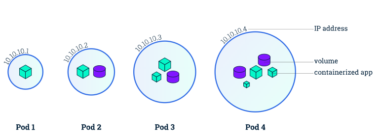

### Pod 생성하기 [](https://blog.heptio.com/core-kubernetes-jazz-improv-over-orchestration-a7903ea92ca)

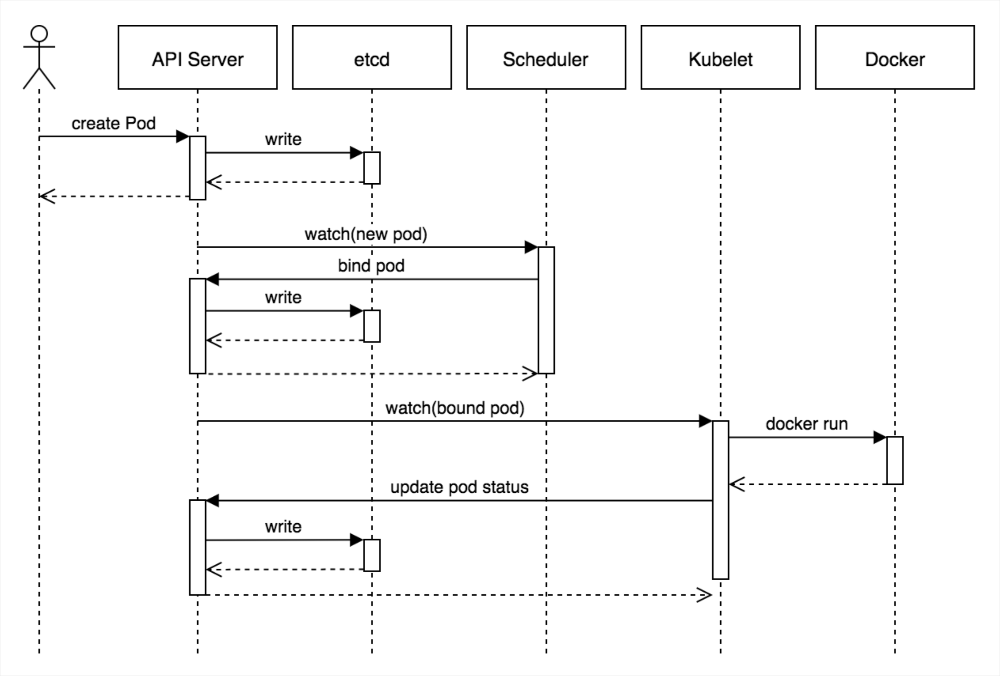

- kubectl은 API Server에 Pod 생성을 요청
- API Server는 etcd에 Node에 할당되지 않은 Pod가 있음을 update
- Scheduler는 etcd의 변경사항을 API Server를 통해 watch하고 Pod을 실행할 Node를 선택하여, API Server에 해당 Node에 Pod을 배정하도록 update
- 해당 Node의 Kubelet은 생성할 Pod 정보를 watch해서 Docker Container를 실행하고 결과를 API Server에 지속적으로 update
- API Server는 전달받은 Pod의 State를 etcd에 update

## ReplicaSet

- ReplicaSet은 Pod (Object)을 복제 생성하고, 복제된 Pod의 개수를 (Spec에 정의된 개수만큼) 지속적으로 유지하는 Object이다.
- 직접적으로 ReplicaSet을 사용하기보다는 Deployment등 다른 object에 의해서 사용되는 경우가 많다.
- ReplicaSet은 Pod의 Replication 관리만 한다. ReplicaSet에 의해 3개의 Pod이 실행 중인 상태에서 ReplicaSet을 삭제하면, 해당 ReplicaSet의 관리 대상이었던 Pod은 삭제되지 않고 실행상태로 유지 가능하다. (ReplicaSet이 Pod을 소유하는 개념이 아닌, 특정한 Label Selector Rule에 따라 Pod의 개수/상태를 유지하는 역할만 수행)

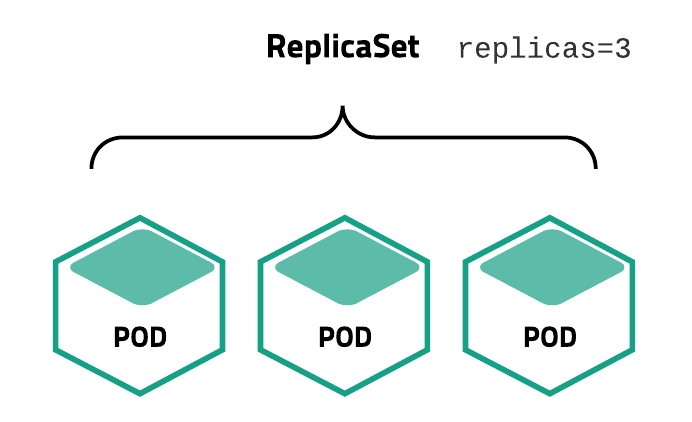

### ReplicaSet 생성하기 [](https://leanpub.com/the-devops-2-3-toolkit)

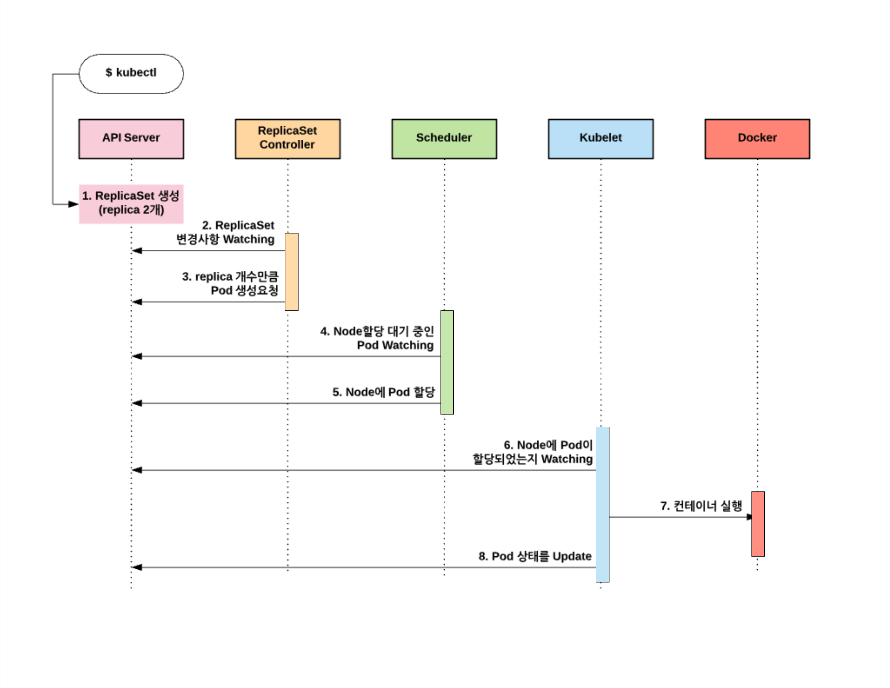

- kubectl create 명령으로 ReplicaSet 생성을 요청하면 다음과 같이 ReplicaSet을 생성하고, ReplicaSet Controller에 의해서 Pod을 생성한다.
- 모든 상태는 Etcd에 저장되고 ReplicaSet Controller, Scheduler, Kubelet등은 Etcd에 바로 접근하는 것이 아니고 API Server를 경유해서 Etcd의 데이터에 접근한다.

## Service [](https://medium.com/google-cloud/kubernetes-nodeport-vs-loadbalancer-vs-ingress-when-should-i-use-what-922f010849e0)

- Network와 관련된 Object로 Pod를 외부 네트워크와 연결해주고, 여러 개의 Pod을 바라보는 내부 Load Balancer를 생성할 때 사용한다.
- 내부 DNS에 Service Name을 Domain으로 등록하기 때문에 Service Discovery 역할도 담당한다.

```bash
apiVersion: v1
kind: Service
metadata:  
  name: my-internal-service
spec:
  selector:    
    app: my-app
  type: ClusterIP # ClusterIP는 k8s 기본 서비스로, cluster 내의 다른 app이 접근할 수 있게 해준다. ClusterIP는 외부 접근이 되지 않는다. (Kubernetes Proxy를 통하면 접근 가능)
  ports:  
  - name: http
    port: 80
    targetPort: 80
    protocol: TCP
```      

#### [Case 1] : Proxy 사용하기

- Service를 debugging하거나 어떤 이유로 PC에서 직접 접근할 때, 내부 dashboard 표시 등 내부 traffic을 허용할 때 사용한다.
- 이 방식에서는 권한 있는 사용자가 kubectl을 실행해야 하기 때문에, 서비스를 외부에 노출하는데 사용하거나 실서비스에서 사용해서는 안 된다.


#### [Case 2] : NodePort 사용하기

- NodePort Service는 service에 외부 traffic을 직접 보낼 수 있는 가장 원시적인 방법이다.
- 모든 Node(VM)에 특정 Port를 열어 두고, 이 port로 보내지는 모든 traffic을 service로 forwarding한다.


- Port당 한 Service만 할당할 수 있으며, 30000-32767 사이의 port만 사용할 수 있다. 또한, Node나 VM의 IP 주소가 바뀌면, 이를 반영해 줘야 한다.

```bash
apiVersion: v1
kind: Service
metadata:  
  name: my-nodeport-service
spec:
  selector:    
    app: my-app
  type: NodePort # node에 어떤 포트를 열어줄지 지정하는 nodePort라는 추가 포트가 있다.
  ports:  
  - name: http
    port: 80
    targetPort: 80
    nodePort: 30036
    protocol: TCP
```

#### [Case 3] : LoadBalancer 사용하기

- Service를 Internet에 Expose하는 일반적인 방식으로 GKE에서는 Network Load Balancer를 작동시켜 모든 traffic을 service로 forwarding하는 단 하나의 IP 주소를 제공한다.


- Service를 직접적으로 expose하기를 원한다면, LoadBalancer가 기본적인 방법이다.
- 지정한 port의 모든 traffic은 service로 forwarding 될 것이다. filtering이나 routing 같은건 전혀 없다. 거의 모든 traffic protocol을 사용할 수 있다.
- 가장 큰 단점은 LoadBalancer로 노출하고자 하는 각 서비스마다 자체의 IP 주소를 갖는 것과, 노출하는 서비스마다 LoadBalancer 비용을 지불해야 하기 때문에 값이 비싸진다.

#### [Case 4] : Ingress 사용하기

- 여러 service들 앞단에서 `Smart Router` 역할을 하거나, cluster의 `Entrypoint` 역할을 한다.
- 기본 GKE Ingress Controller는 HTTP(S) Load Balancer를 만들어 준다. 백엔드 서비스로 경로(path)와 서브 도메인 기반의 라우팅을 모두 지원한다.
- 예를 들어, foo.yourdomain.com으로 들어오는 모든 트래픽을 foo 서비스로 보낼 수 있고, yourdomain.com/bar/ 경로로 들어오는 모든 트래픽을 bar 서비스로 보낼 수 있다.


```bash
apiVersion: extensions/v1beta1
kind: Ingress
metadata:
  name: my-ingress
spec:
  backend:
    serviceName: other
    servicePort: 8080
  rules:
  - host: foo.mydomain.com
    http:
      paths:
      - backend:
          serviceName: foo
          servicePort: 8080
  - host: mydomain.com
    http:
      paths:
      - path: /bar/*
        backend:
          serviceName: bar
          servicePort: 8080
```

- Google Cloud Load Balancer와 Nginx, Contour, Istio 등과 같은 많은 Ingress Controller Type이 있다.
- 동일한(보통 HTTP) L7 Protocol을 사용하는 여러 service들을 같은 IP 주소로 외부에 노출한다면 Ingress가 가장 유용할 것이다.
- Native GCP integration을 사용한다면, 단 하나의 Load Balancer만 지불하면 되고, ingress는 smart하기 때문에 (SSL, Auth, Routing과 같은) 다양한 기능들을 활용할 수 있다.

## Volume [](https://kubernetes.io/ko/docs/concepts/storage/volumes)

- 저장소와 관련된 Object로 Host Directory를 그대로 사용할 수도 있고, EBS(ElasticBlockStore) 같은 Storage를 동적으로 생성하여 사용할 수도 있다.
- Container내의 Disk에 있는 file은 임시적이며, container에서 실행될 때 app에 적지 않은 몇 가지 문제가 발생한다.
	- 첫째, container가 충돌되면, kubelet은 container를 재시작하지만, container는 초기 상태로 시작되기 때문에 기존 파일이 유실된다.
	- 둘째, Pod에서 container를 함께 실행할 때 container간에 file을 공유해야 하는 경우 `volume 추상화`로 이 두 가지 문제를 모두 해결해 준다.

[AWS EBS 구성 예시]

```bash
apiVersion: v1
kind: Pod
metadata:
  name: test-ebs
spec:
  containers:
  - image: k8s.gcr.io/test-webserver
    name: test-container
    volumeMounts:
    - mountPath: /test-ebs
      name: test-volume
  volumes:
  - name: test-volume
    # 이 AWS EBS 볼륨은 이미 존재해야 한다.
    awsElasticBlockStore:
      volumeID: <volume-id>
      fsType: ext4
```

---

# Minikube Sample Project [](https://www.katacoda.com/courses/kubernetes)

## Minikube 설치 [](https://kubernetes.io/ko/docs/tasks/tools/install-minikube/)

- kubectl 설치
- hypervisor 설치
- 패키지를 이용하여 Minikube 설치

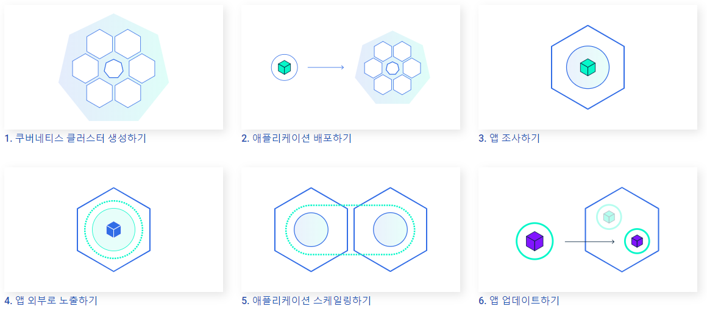

## Cluster 생성하기

- k8s는 서로 연결되어서 단일 유닛처럼 동작하는 고가용성의 컴퓨터 클러스터를 상호 조정한다.
- k8s는 애플리케이션 컨테이너를 클러스터에 분산시키고 스케줄링하는 일을 보다 효율적으로 자동화한다.

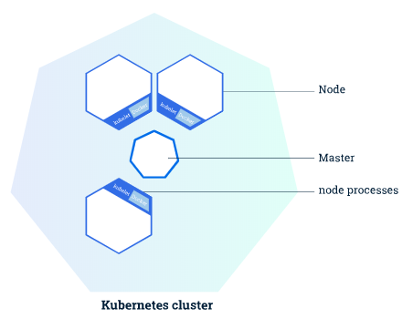

```bash
$ minikube version
minikube version: v1.8.1
commit: cbda04cf6bbe65e987ae52bb393c10099ab62014

# Start the cluster, Minikube started a virtual machine & Kubernetes cluster is now running in that VM
$ minikube start
* minikube v1.8.1 on Ubuntu 18.04
* Using the none driver based on user configuration
* Running on localhost (CPUs=2, Memory=2460MB, Disk=145651MB) ...
* OS release is Ubuntu 18.04.4 LTS
* Preparing Kubernetes v1.17.3 on Docker 19.03.6 ...
  - kubelet.resolv-conf=/run/systemd/resolve/resolv.conf
* Launching Kubernetes ...
* Enabling addons: default-storageclass, storage-provisioner
* Configuring local host environment ...
* Waiting for cluster to come online ...
* Done! kubectl is now configured to use "minikube"

# client version is the kubectl version, server version is the Kubernetes version installed on the master
$ kubectl cluster-info
Kubernetes master is running at https://172.17.0.19:8443
KubeDNS is running at https://172.17.0.19:8443/api/v1/namespaces/kube-system/services/kube-dns:dns/proxy

To further debug and diagnose cluster problems, use 'kubectl cluster-info dump'.
```

## kubectl을 사용해서 deployment 생성하기

- kubectl은 지정된 리소스(node, container)에서 지정된 작업(create, describe 등)이 수행된다.
- deployment는 application instance를 생성하고 update하는 역할을 담당한다.
- application이 k8s 상에 배포되려면 지원되는 container 형식 중 하나로 packaging 되어야 한다.

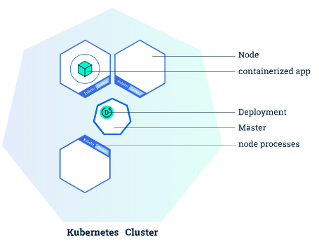

```bash
# Check kubectl installed
$ kubectl version
Client Version: version.Info{Major:"1", Minor:"17", GitVersion:"v1.17.3", GitCommit:"06ad960bfd03b39c8310aaf92d1e7c12ce618213", GitTreeState:"clean", BuildDate:"2020-02-11T18:14:22Z", GoVersion:"go1.13.6", Compiler:"gc", Platform:"linux/amd64"}
Server Version: version.Info{Major:"1", Minor:"17", GitVersion:"v1.17.3", GitCommit:"06ad960bfd03b39c8310aaf92d1e7c12ce618213", GitTreeState:"clean", BuildDate:"2020-02-11T18:07:13Z", GoVersion:"go1.13.6", Compiler:"gc", Platform:"linux/amd64"}

# view the nodes in the cluster
$ kubectl get nodes
NAME       STATUS   ROLES    AGE   VERSION
minikube   Ready    master   25s   v1.17.3
```

- 첫 번째 app을 Kubectl create deployment 명령과 함께 Kubernetes에 배치한다. 배포 이름과 앱 이미지 위치(Docker 허브 외부에서 호스팅되는 이미지에 대한 전체 리포지토리 URL 포함)를 제공해야 한다.

```bash
$ kubectl create deployment kubernetes-bootcamp --image=gcr.io/google-samples/kubernetes-bootcamp:v1
deployment.apps/kubernetes-bootcamp created
```

- 응용 프로그램 인스턴스가 실행될 수 있는 적합한 노드를 검색함(사용 가능한 노드가 1개임)
- 해당 노드에서 실행되도록 응용 프로그램을 예약하고 필요할 때, 새 노드에서 인스턴스를 다시 예약하도록 클러스터 구성한다.

```bash
# 앱의 단일 인스턴스를 실행하는 배포가 1개 있는 것으로 확인. 인스턴스가 노드의 도커 컨테이너 내에서 실행 중
$ kubectl get deployments
NAME                  READY   UP-TO-DATE   AVAILABLE   AGE
kubernetes-bootcamp   1/1     1            1           2m58s
```

- kubectl을 사용하여, API endpoint를 통해 어플리케이션과 상호작용이 가능하다.

```bash
# run proxy, connect host (the online terminal) and the Kubernetes cluster.
$ kubectl proxy

# proxy endpoint을 통해 호스팅되는 API를 모두 볼 수 있는데 curl 명령을 사용하여 API를 통해 버전을 직접 쿼리할 수 있다.
$ curl http://localhost:8001/version
```

---

## Pod와 Node 보기

- Pod는 하나 또는 그 이상의 application container (docker 또는 rkt와 같은)들의 group이고, 공유 Storage(Volume), IP 주소 그리고 그것을 동작시키는 방식에 대한 정보를 포함하고 있다.
- 만약 container들이 밀접하고 결합되어 있고 디스크와 같은 자원을 공유해야 한다면, 오직 하나의 단일 pod에 함께 schedule되어야 한다.
- Node는 k8s에 있어서 워커 머신이며, cluster에 따라 VM 또는 물리 머신이 될 수 있다. 여러 개의 pod는 하나의 node 위에서 동작할 수 있다.

```bash
# pod의 container에 대한 세부 정보를 확인 (IP 주소, 사용된 port 및 pod의 lifecycle과 관련된 event 목록)
$ kubectl describe pods
Name:         kubernetes-bootcamp-765bf4c7b4-5crss
Namespace:    default
Priority:     0
Node:         minikube/172.17.0.20
Start Time:   Tue, 07 Jul 2020 05:15:17 +0000
Labels:       pod-template-hash=765bf4c7b4
              run=kubernetes-bootcamp
Annotations:  <none>
Status:       Running
IP:           172.18.0.4
IPs:
  IP:           172.18.0.4
Controlled By:  ReplicaSet/kubernetes-bootcamp-765bf4c7b4
Containers:
  kubernetes-bootcamp:
    Container ID:   docker://ce1d6c307792bb52810155fd33252cb26e192b19f892fe093dec747e6b1b18ba
    Image:          gcr.io/google-samples/kubernetes-bootcamp:v1
    Image ID:       docker-pullable://jocatalin/kubernetes-bootcamp@sha256:0d6b8ee63bb57c5f5b6156f446b3bc3b3c143d233037f3a2f00e279c8fcc64af
    Port:           8080/TCP
    Host Port:      0/TCP
    State:          Running
      Started:      Tue, 07 Jul 2020 05:15:19 +0000
    Ready:          True
    Restart Count:  0
    Environment:    <none>
    Mounts:
      /var/run/secrets/kubernetes.io/serviceaccount from default-token-2tkqm (ro)
Conditions:
  Type              Status
  Initialized       True
  Ready             True
  ContainersReady   True
  PodScheduled      True
Volumes:
  default-token-2tkqm:
    Type:        Secret (a volume populated by a Secret)
    SecretName:  default-token-2tkqm
    Optional:    false
QoS Class:       BestEffort
Node-Selectors:  <none>
Tolerations:     node.kubernetes.io/not-ready:NoExecute for 300s
                 node.kubernetes.io/unreachable:NoExecute for 300s
Events:
  Type     Reason            Age   From               Message
  ----     ------            ----  ----               -------
  Warning  FailedScheduling  45s   default-scheduler  0/1 nodes are available: 1 node(s) had taints that the pod didn't tolerate.
  Normal   Scheduled         39s   default-scheduler  Successfully assigned default/kubernetes-bootcamp-765bf4c7b4-5crss to minikube
  Normal   Pulled            37s   kubelet, minikube  Container image "gcr.io/google-samples/kubernetes-bootcamp:v1" already present on machine
  Normal   Created           37s   kubelet, minikube  Created container kubernetes-bootcamp
  Normal   Started           37s   kubelet, minikube  Started container kubernetes-bootcamp
$
```

- Pods가 분리된 private network에서 실행 중이므로 proxy access가 필요한데 kubectel 프록시 명령을 사용하여 두 번째 터미널 창에서 프록시를 실행한다.

```bash
# run proxy
$ echo -e "\n\n\n\e[92mStarting Proxy. After starting it will not output a response. Please click the first Terminal Tab\n"
$ kubectl proxy

Starting Proxy. After starting it will not output a response. Please click the first Terminal Tab
Starting to serve on 127.0.0.1:8001

# Pod name을 알아내서 proxy를 통해 직접 그 Pod에게 질문하고, Pod name을 가져와서 POD_NAME 환경 변수에 저장한다.
$ export POD_NAME=$(kubectl get pods -o go-template --template '{{range .items}}{{.metadata.name}}{{"\n"}}{{end}}')
$ echo Name of the Pod: $POD_NAME
Name of the Pod: kubernetes-bootcamp-765bf4c7b4-5crss

# app의 결과를 보기 위해 curl 명령 수행
$ curl http://localhost:8001/api/v1/namespaces/default/pods/$POD_NAME/proxy/
Hello Kubernetes bootcamp! | Running on: kubernetes-bootcamp-765bf4c7b4-5crss | v=1
```

- application이 STDOUT로 전송하는 모든 것은 pod내의 container에 대한 log가 된다. kubectel logs 명령을 사용하여 이 로그들을 검색할 수 있다.

```bash
# pod 안에 container가 하나뿐이기 때문에 container name을 지정할 필요가 없다.
$ kubectl logs $POD_NAME
Kubernetes Bootcamp App Started At: 2020-07-07T05:15:19.950Z | Running On:  kubernetes-bootcamp-765bf4c7b4-5crss

Running On: kubernetes-bootcamp-765bf4c7b4-5crss | Total Requests: 1 | App Uptime: 583.042 seconds | Log Time: 2020-07-07T05:25:02.992Z
```

- pod가 작동되면 container에서 exec 명령을 사용하고 pod의 이름을 매개 변수로 사용하여 직접 명령을 실행할 수 있다.

```bash
$ kubectl exec $POD_NAME env
PATH=/usr/local/sbin:/usr/local/bin:/usr/sbin:/usr/bin:/sbin:/bin
HOSTNAME=kubernetes-bootcamp-765bf4c7b4-5crss
KUBERNETES_PORT_443_TCP_PROTO=tcp
KUBERNETES_PORT_443_TCP_PORT=443
KUBERNETES_PORT_443_TCP_ADDR=10.96.0.1
KUBERNETES_SERVICE_HOST=10.96.0.1
KUBERNETES_SERVICE_PORT=443
KUBERNETES_SERVICE_PORT_HTTPS=443
KUBERNETES_PORT=tcp://10.96.0.1:443
KUBERNETES_PORT_443_TCP=tcp://10.96.0.1:443
NPM_CONFIG_LOGLEVEL=info
NODE_VERSION=6.3.1
HOME=/root

# pod의 container안에 있는 bash session을 시작
$ kubectl exec -ti $POD_NAME bash
root@kubernetes-bootcamp-765bf4c7b4-5crss:/#

# NodeJS app을 실행하는 container에 개방형 콘솔을 설치. app의 source code가 server.js 파일에 있음
root@kubernetes-bootcamp-765bf4c7b4-5crss:/# cat server.js
var http = require('http');
var requests=0;
var podname= process.env.HOSTNAME;
var startTime;
var host;
var handleRequest = function(request, response) {
  response.setHeader('Content-Type', 'text/plain');
  response.writeHead(200);
  response.write("Hello Kubernetes bootcamp! | Running on: ");
  response.write(host);
  response.end(" | v=1\n");
  console.log("Running On:" ,host, "| Total Requests:", ++requests,"| App Uptime:", (new Date() - startTime)/1000 , "seconds", "| Log Time:",new Date());
}
var www = http.createServer(handleRequest);
www.listen(8080,function () {
    startTime = new Date();;
    host = process.env.HOSTNAME;
    console.log ("Kubernetes Bootcamp App Started At:",startTime, "| Running On: " ,host, "\n");
});

# curl 명령으로 app이 실행 중인지 확인
root@kubernetes-bootcamp-765bf4c7b4-5crss:/# curl localhost:8080
Hello Kubernetes bootcamp! | Running on: kubernetes-bootcamp-765bf4c7b4-5crss | v=1

root@kubernetes-bootcamp-765bf4c7b4-5crss:/# exit
exit
$
```

---

## 앱 노출을 위해 서비스 이용하기

- k8s `Service`는 논리적 pod set을 정의하고 외부 traffic exposure, load balancing, 그 pod들에 대한 service discovery를 가능하게 해주는 abstract layer이다.

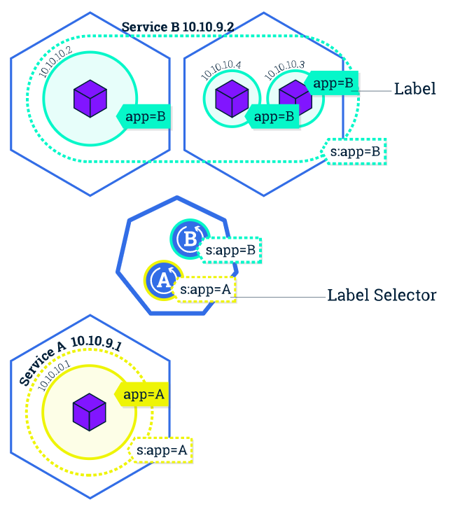

[Step 1] Create a new service

```bash
# service list 확인
$ kubectl get services
NAME         TYPE        CLUSTER-IP   EXTERNAL-IP   PORT(S)   AGE
kubernetes   ClusterIP   10.96.0.1    <none>        443/TCP   31s

# 새 서비스를 생성하고 이를 외부 트래픽에 노출하려면, nodePort를 매개 변수로 사용하여 노출 명령을 사용
$ kubectl expose deployment/kubernetes-bootcamp --type="NodePort" --port 8080
service/kubernetes-bootcamp exposed

# # kubernetes-bootcamp 서비스를 운영 중으로. 고유한 클러스터-IP, 내부 포트 및 외부 IP(노드의 IP)를 수신했음을 알 수 있다.
$ kubectl get services
NAME                  TYPE        CLUSTER-IP      EXTERNAL-IP   PORT(S)          AGE
kubernetes            ClusterIP   10.96.0.1       <none>        443/TCP          2m11s
kubernetes-bootcamp   NodePort    10.104.106.67   <none>        8080:31283/TCP   20s

# 외부에서 어떤 port가 열려 있는지 확인(NodePort 옵션을 통해)할 수 있다.
$ kubectl describe services/kubernetes-bootcamp
Name:                     kubernetes-bootcamp
Namespace:                default
Labels:                   run=kubernetes-bootcamp
Annotations:              <none>
Selector:                 run=kubernetes-bootcamp
Type:                     NodePort
IP:                       10.104.106.67
Port:                     <unset>  8080/TCP
TargetPort:               8080/TCP
NodePort:                 <unset>  31283/TCP
Endpoints:                172.18.0.3:8080
Session Affinity:         None
External Traffic Policy:  Cluster
Events:                   <none>

# 노드 포트 값이 할당된 NODE_PORT라는 환경 변수를 생성한다.
$ export NODE_PORT=$(kubectl get services/kubernetes-bootcamp -o go-template='{{(index .spec.ports 0).nodePort}}')
$ echo NODE_PORT=$NODE_PORT
NODE_PORT=31283

# curl, Node의 IP 및 외부 노출 포트를 사용하여 app이 cluster 외부에 노출되는지 테스트할 수 있다.
$ curl $(minikube ip):$NODE_PORT
Hello Kubernetes bootcamp! | Running on: kubernetes-bootcamp-765bf4c7b4-pfg74 | v=1
```

[Step 2] Using labels

```bash
# Deployment가 자동으로 pod의 label을 생성하고, descript deployment 명령을 사용하여 label name을 볼 수 있다.
$ kubectl describe deployment
Name:                   kubernetes-bootcamp
Namespace:              default
CreationTimestamp:      Tue, 07 Jul 2020 05:42:02 +0000
Labels:                 run=kubernetes-bootcamp
Annotations:            deployment.kubernetes.io/revision: 1
Selector:               run=kubernetes-bootcamp
Replicas:               1 desired | 1 updated | 1 total | 1 available | 0 unavailable
StrategyType:           RollingUpdate
MinReadySeconds:        0
RollingUpdateStrategy:  25% max unavailable, 25% max surge
Pod Template:
  Labels:  run=kubernetes-bootcamp
  Containers:
   kubernetes-bootcamp:
    Image:        gcr.io/google-samples/kubernetes-bootcamp:v1
    Port:         8080/TCP
    Host Port:    0/TCP
    Environment:  <none>
    Mounts:       <none>
  Volumes:        <none>
Conditions:
  Type           Status  Reason
  ----           ------  ------
  Available      True    MinimumReplicasAvailable
  Progressing    True    NewReplicaSetAvailable
OldReplicaSets:  <none>
NewReplicaSet:   kubernetes-bootcamp-765bf4c7b4 (1/1 replicas created)
Events:
  Type    Reason             Age   From                   Message
  ----    ------             ----  ----                   -------
  Normal  ScalingReplicaSet  8m    deployment-controller  Scaled up replica set kubernetes-bootcamp-765bf4c7b4 to 1


# 이 label을 사용하여 pod list를 조회한다.
$ kubectl get pods -l run=kubernetes-bootcamp
NAME                                   READY   STATUS    RESTARTS   AGE
kubernetes-bootcamp-765bf4c7b4-pfg74   1/1     Running   0          9m59s

$ kubectl get services -l run=kubernetes-bootcamp
NAME                  TYPE       CLUSTER-IP      EXTERNAL-IP   PORT(S)          AGE
kubernetes-bootcamp   NodePort   10.104.106.67   <none>        8080:31283/TCP   8m35s

# pod name을 가져와서 POD_NAME 환경 변수에 저장
$ export POD_NAME=$(kubectl get pods -o go-template --template '{{range .items}}{{.metadata.name}}{{"\n"}}{{end}}')
$ echo Name of the Pod: $POD_NAME
Name of the Pod: kubernetes-bootcamp-765bf4c7b4-pfg74

# 새 label을 적용하려면 label 명령 뒤에 개체 유형, 개체 이름 및 새 레이블을 사용한다.
$ kubectl label pod $POD_NAME app=v1
pod/kubernetes-bootcamp-765bf4c7b4-pfg74 labeled

# 새로운 label이 포드(Pod에 애플리케이션 버전을 고정)에 적용되며, describe pod 명령으로 확인한다.
$ kubectl describe pods $POD_NAME
Name:         kubernetes-bootcamp-765bf4c7b4-pfg74
Namespace:    default
Priority:     0
Node:         minikube/172.17.0.54
Start Time:   Tue, 07 Jul 2020 05:42:17 +0000
Labels:       app=v1
              pod-template-hash=765bf4c7b4
              run=kubernetes-bootcamp
Annotations:  <none>
Status:       Running
IP:           172.18.0.3
IPs:
  IP:           172.18.0.3
Controlled By:  ReplicaSet/kubernetes-bootcamp-765bf4c7b4
Containers:
  kubernetes-bootcamp:
    Container ID:   docker://580cc66832a738962a8eec45e3ba519153a2cbe305b7d77e553cd819fae28ec3
    Image:          gcr.io/google-samples/kubernetes-bootcamp:v1
    Image ID:       docker-pullable://jocatalin/kubernetes-bootcamp@sha256:0d6b8ee63bb57c5f5b6156f446b3bc3b3c143d233037f3a2f00e279c8fcc64af
    Port:           8080/TCP
    Host Port:      0/TCP
    State:          Running
      Started:      Tue, 07 Jul 2020 05:42:19 +0000
    Ready:          True
    Restart Count:  0
    Environment:    <none>
    Mounts:
      /var/run/secrets/kubernetes.io/serviceaccount from default-token-zfqqp (ro)
Conditions:
  Type              Status
  Initialized       True
  Ready             True
  ContainersReady   True
  PodScheduled      True
Volumes:
  default-token-zfqqp:
    Type:        Secret (a volume populated by a Secret)
    SecretName:  default-token-zfqqp
    Optional:    false
QoS Class:       BestEffort
Node-Selectors:  <none>
Tolerations:     node.kubernetes.io/not-ready:NoExecute for 300s
                 node.kubernetes.io/unreachable:NoExecute for 300s
Events:
  Type     Reason            Age                From               Message
  ----     ------            ----               ----               -------
  Warning  FailedScheduling  13m (x2 over 13m)  default-scheduler  0/1 nodes are available: 1 node(s) had taints that the pod didn't tolerate.
  Normal   Scheduled         13m                default-scheduler  Successfully assigned default/kubernetes-bootcamp-765bf4c7b4-pfg74 to minikube
  Normal   Pulled            13m                kubelet, minikube  Container image "gcr.io/google-samples/kubernetes-bootcamp:v1" already present on machine
  Normal   Created           13m                kubelet, minikube  Created container kubernetes-bootcamp
  Normal   Started           13m                kubelet, minikube  Started container kubernetes-bootcamp
```

```bash
# label이 pod에 attach되고, 새로운 label을 사용하여 pod list를 조회할 수 있다.
$ kubectl get pods -l app=v1
NAME                                   READY   STATUS    RESTARTS   AGE
kubernetes-bootcamp-765bf4c7b4-pfg74   1/1     Running   0          15m
```

[Step 3] Deleting a service

```bash
$ kubectl delete service -l run=kubernetes-bootcamp
service "kubernetes-bootcamp" deleted

# service가 정상 제거되었는지 확인
$ curl $(minikube ip):$NODE_PORT
curl: (7) Failed to connect to 172.17.0.54 port 31283: Connection refused

# app이 cluster 외부에서 더 이상 접속할 수 없다는 것을 확인한다. pod 내부에 curl이 있는 상태에서 app이 여전히 실행 중인지 확인할 수 있다.
# 애플리케이션을 종료하려면 배포도 삭제해야 함을 알 수 있다.
$ kubectl exec -ti $POD_NAME curl localhost:8080
Hello Kubernetes bootcamp! | Running on: kubernetes-bootcamp-765bf4c7b4-pfg74 | v=1
```

---

## 복수의 앱 인스턴스 구동하기

- kubectl run 명령에 --replicas 파라미터를 사용해서 처음부터 복수의 인스턴스로 구동되는 deployment를 만들 수 있다.
- deployment의 복제 수를 변경하면 scaling이 수행된다.

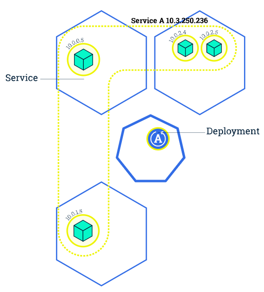

[Step 1] Scaling a deployment

```bash
# Deployment에 의해 생성된 ReplicaSet이 있는지 확인한다.
$ kubectl get rs
NAME                             DESIRED   CURRENT   READY   AGE
kubernetes-bootcamp-765bf4c7b4   1         1         1       44s

# Deployment를 4개의 ReplicaSet으로 확장
$ kubectl scale deployments/kubernetes-bootcamp --replicas=4
deployment.apps/kubernetes-bootcamp scaled

$ kubectl get deployments
NAME                  READY   UP-TO-DATE   AVAILABLE   AGE
kubernetes-bootcamp   4/4     4            4           2m8s

# 현재 4개의 pod이 있으며, IP 주소가 다르다. 변경 사항은 배포 이벤트 로그에 등록된다.
$ kubectl describe deployments/kubernetes-bootcamp
Name:                   kubernetes-bootcamp
Namespace:              default
CreationTimestamp:      Tue, 07 Jul 2020 06:04:53 +0000
Labels:                 run=kubernetes-bootcamp
Annotations:            deployment.kubernetes.io/revision: 1
Selector:               run=kubernetes-bootcamp
Replicas:               4 desired | 4 updated | 4 total | 4 available | 0 unavailable
StrategyType:           RollingUpdate
MinReadySeconds:        0
RollingUpdateStrategy:  25% max unavailable, 25% max surge
Pod Template:
  Labels:  run=kubernetes-bootcamp
  Containers:
   kubernetes-bootcamp:
    Image:        gcr.io/google-samples/kubernetes-bootcamp:v1
    Port:         8080/TCP
    Host Port:    0/TCP
    Environment:  <none>
    Mounts:       <none>
  Volumes:        <none>
Conditions:
  Type           Status  Reason
  ----           ------  ------
  Progressing    True    NewReplicaSetAvailable
  Available      True    MinimumReplicasAvailable
OldReplicaSets:  <none>
NewReplicaSet:   kubernetes-bootcamp-765bf4c7b4 (4/4 replicas created)
Events:
  Type    Reason             Age    From                   Message
  ----    ------             ----   ----                   -------
  Normal  ScalingReplicaSet  2m55s  deployment-controller  Scaled up replica set kubernetes-bootcamp-765bf4c7b4 to 1
  Normal  ScalingReplicaSet  65s    deployment-controller  Scaled up replica set kubernetes-bootcamp-765bf4c7b4 to 4
```

[Step 2] Load Balancing

```bash
# 서비스에서 트래픽을 load-balancing하고 있는지 확인한다.
$ kubectl describe services/kubernetes-bootcamp
Name:                     kubernetes-bootcamp
Namespace:                default
Labels:                   run=kubernetes-bootcamp
Annotations:              <none>
Selector:                 run=kubernetes-bootcamp
Type:                     NodePort
IP:                       10.103.87.185
Port:                     <unset>  8080/TCP
TargetPort:               8080/TCP
NodePort:                 <unset>  30730/TCP
Endpoints:                172.18.0.5:8080,172.18.0.7:8080,172.18.0.8:8080 + 1 more...
Session Affinity:         None
External Traffic Policy:  Cluster
Events:                   <none>

# NODE_PORT라는 노드 포트로 값을 갖는 환경 변수 생성
$ export NODE_PORT=$(kubectl get services/kubernetes-bootcamp -o go-template='{{(index .spec.ports 0).nodePort}}')
$ echo NODE_PORT=$NODE_PORT
NODE_PORT=30730

# curl 명령으로 load-balancing이 제대로 작동되는지 확인
$ curl $(minikube ip):$NODE_PORT
Hello Kubernetes bootcamp! | Running on: kubernetes-bootcamp-765bf4c7b4-rfldx | v=1
$ curl $(minikube ip):$NODE_PORT
Hello Kubernetes bootcamp! | Running on: kubernetes-bootcamp-765bf4c7b4-8kjgl | v=1
$ curl $(minikube ip):$NODE_PORT
Hello Kubernetes bootcamp! | Running on: kubernetes-bootcamp-765bf4c7b4-rfldx | v=1
$ curl $(minikube ip):$NODE_PORT
Hello Kubernetes bootcamp! | Running on: kubernetes-bootcamp-765bf4c7b4-8kjgl | v=1
```

[Step 3] Scale Down

```bash
# 서비스를 2개의 ReplicaSet으로 축소
$ kubectl scale deployments/kubernetes-bootcamp --replicas=2
deployment.apps/kubernetes-bootcamp scaled

$ kubectl get deployments
NAME                  READY   UP-TO-DATE   AVAILABLE   AGE
kubernetes-bootcamp   2/2     2            2           8m30s

# 2 Pods가 terminated된 걸 확인
$ kubectl get pods -o wide
NAME                                   READY   STATUS    RESTARTS   AGE     IP           NODE     NOMINATED NODE   READINESS GATES
kubernetes-bootcamp-765bf4c7b4-8kjgl   1/1     Running   0          6m41s   172.18.0.9   minikube   <none>           <none>
kubernetes-bootcamp-765bf4c7b4-qnn5m   1/1     Running   0          8m30s   172.18.0.5   minikube   <none>           <none>
```

---

## Rolling Update 수행하기

- 롤링 업데이트는 pod instance를 점진적으로 새로운 것으로 update하여 deployment update가 service 중단 없이 이루어질 수 있도록 해준다.
- deployment가 외부로 노출되면, service는 update가 이루어지는 동안 오직 가용한 pod에게만 traffic을 load-balance 할 것이다.

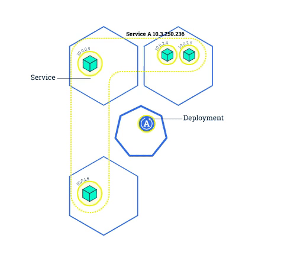

[Step 1] Update the version of the app

```bash
# application의 image를 version 2로 update하려면, set image 명령을 사용하고 deployment name 및 새 image version을 사용한다.
$ kubectl set image deployments/kubernetes-bootcamp kubernetes-bootcamp=jocatalin/kubernetes-bootcamp:v2
deployment.apps/kubernetes-bootcamp image updated

# command가 Deployment에 app의 다른 이미지를 사용하도록 통보하고, rolling update를 시작함 새 포드 상태를 확인하고, get pods 명령으로 종료되는 기존 pod를 볼 수 있다.
$ kubectl get pods
NAME                                   READY   STATUS        RESTARTS   AGE
kubernetes-bootcamp-765bf4c7b4-8fpts   1/1     Terminating   0          102s
kubernetes-bootcamp-765bf4c7b4-knq2l   1/1     Terminating   0          102s
kubernetes-bootcamp-765bf4c7b4-m7z8n   1/1     Terminating   0          102s
kubernetes-bootcamp-765bf4c7b4-pcr9w   1/1     Terminating   0          102s
kubernetes-bootcamp-7d6f8694b6-7m2rq   1/1     Running       0          14s
kubernetes-bootcamp-7d6f8694b6-n5gxg   1/1     Running       0          20s
kubernetes-bootcamp-7d6f8694b6-rts28   1/1     Running       0          16s
kubernetes-bootcamp-7d6f8694b6-xwn7k   1/1     Running       0          21s
```

[Step 2] Verify an update

```bash
# app 실행 여부를 확인한다.
$ kubectl describe services/kubernetes-bootcamp
Name:                     kubernetes-bootcamp
Namespace:                default
Labels:                   run=kubernetes-bootcamp
Annotations:              <none>
Selector:                 run=kubernetes-bootcamp
Type:                     NodePort
IP:                       10.105.225.213
Port:                     <unset>  8080/TCP
TargetPort:               8080/TCP
NodePort:                 <unset>  31853/TCP
Endpoints:                172.18.0.10:8080,172.18.0.11:8080,172.18.0.12:8080 + 1 more...
Session Affinity:         None
External Traffic Policy:  Cluster
Events:                   <none>

# 할당된 노드 포트 값을 가진 NODE_PORT라는 환경 변수 생성
$ export NODE_PORT=$(kubectl get services/kubernetes-bootcamp -o go-template='{{(index .spec.ports 0).nodePort}}')
$ echo NODE_PORT=$NODE_PORT
NODE_PORT=31853

# 노출된 IP와 port에 대해 curl을 진행
$ curl $(minikube ip):$NODE_PORT
Hello Kubernetes bootcamp! | Running on: kubernetes-bootcamp-7d6f8694b6-7m2rq | v=2

#  원격 설치 상태 명령을 실행하여 업데이트를 확인할 수 있다.
$ kubectl rollout status deployments/kubernetes-bootcamp
deployment "kubernetes-bootcamp" successfully rolled out

# app의 현재 이미지 version을 확인할 수 있다.
$ kubectl describe pods
```

[Step 3] Rollback an update

```bash
# 다른 업데이트를 수행하고 v10으로 태그가 지정된 이미지를 배포해 본다.
$ kubectl set image deployments/kubernetes-bootcamp kubernetes-bootcamp=gcr.io/google-samples/kubernetes-bootcamp:v10
deployment.apps/kubernetes-bootcamp image updated

$ kubectl get deployments
NAME                  READY   UP-TO-DATE   AVAILABLE   AGE
kubernetes-bootcamp   3/4     2            3           8m35s

$ kubectl get pods
NAME                                   READY   STATUS             RESTARTS   AGE
kubernetes-bootcamp-7d6f8694b6-n5gxg   1/1     Running            0          8m43s
kubernetes-bootcamp-7d6f8694b6-rts28   1/1     Running            0          8m39s
kubernetes-bootcamp-7d6f8694b6-xwn7k   1/1     Running            0          8m44s
kubernetes-bootcamp-886577c5d-cxcnq    0/1     ImagePullBackOff   0          113s  # Version Error
kubernetes-bootcamp-886577c5d-hp5tm    0/1     ErrImagePull       0          112s  # Version Error

# 저장소에 v10이라는 이미지가 없는 걸 확인하고, 이전에 작업했던 버전으로 되돌아가 본다.
$ kubectl rollout undo deployments/kubernetes-bootcamp
deployment.apps/kubernetes-bootcamp rolled back

$ kubectl get pods
NAME                                   READY   STATUS    RESTARTS   AGE
kubernetes-bootcamp-7d6f8694b6-n5gxg   1/1     Running   0          9m18s
kubernetes-bootcamp-7d6f8694b6-rts28   1/1     Running   0          9m14s
kubernetes-bootcamp-7d6f8694b6-xwn7k   1/1     Running   0          9m19s
kubernetes-bootcamp-7d6f8694b6-z2t5n   1/1     Running   0          21s
```

---

## Management Platform

Docker 및 k8s cluster를 배포 관리할 수 있는 플랫폼들을 알아보자.

- Rancher 2.0, OpenShift(Red Hat), Tectonic(CoreOS), Docker Enterprise Edition 등
- Service Mesh(Istio, linkerd), CI(Tekton, Spinnaker), Container Serverless(Knative), Machine Learning(kubeflow)이 모두 kube 환경

[평가 요소]

- k8s cluster의 provisioning
- 고가용성 및 복구
- 지원되는 배포 model
- 필수 구성 요소 및 운영 체제 요구 사항
- monitoring 및 운영 관리
- multi-cluster 관리 등

#### RHOCP (Red Hat OpenShift Container Platform)
- 순수 Open Source Model
- Enterprise `지원 관점`에서 OpenShift는 Rancher보다 약 5배 비쌈
- Red Hat OS에 국한되며 Windows를 지원하지 않음
- Docker Image의 전체 Life-cycle를 관리

#### Pivotal Cloud Foundry (PCF)
- PAS (Pivotal Application Service) & Pivotal Container Service (PKS)로 구성
- `Ubuntu에서만 실행`되며 값 비싼 모델이라 기업에 친숙하지 않은 가격 Model
- Open-Core Model, Microsoft Windows Server를 지원
- 개발자가 사전 개발된 Docker Image를 맞춤 개발하여 registry에서 배포 가능
- Spring Boot 및 Spring Cloud를 사용하는 12팩터 응용 프로그램을 제공

#### Rancher v.2.0 [](https://rancher.com)
- Linux host, docker container, k8s node 위에서 위치나 인프라와 관계 없이 관리하며, Amazon EKS, Google k8s engine, Azure container service, 기타 서비스로서의 k8s cloud에서 k8s cluster 관리 가능

#### CoreOS Tectonic
- container 중심의 linux 배포판과 enterprise급 k8s 배포판을 제공. 이 두 개가 합쳐진 것이 Tectonic stack의 기반을 형성
- CoreOS 운영 체제인 `Container Linux`는 콘테이너화된 구성요소의 모음으로 제공된다는 점에서 차별점을 지닌다.
- 실행 중인 애플리케이션을 중단할 필요 없이, OS에 대한 자동화된 업데이트를 가능하게 해 준다.

#### Platform9 Managed k8s
- 다양한 환경(Local baremetal, 원격 public cloud 등)에서도 실행되지만, 플랫폼9의 서비스 형태로 원격 관리
- 플랫폼9는 매니지드 쿠버네티스에 대한 업데이트를 약 6주에 한번씩 고객 감시 하에 내보낸다.
- Severless Compute 또는 FaaS라고도 하는데 거의 대부분의 프로그래밍 언어와 콘테이너화된 런타임으로 작동된다.


### ★ Considerations

- k8s cluster에 Deployment를 배포하고 Ingress를 연결하자. Nginx말고 Traefik Ingress도 좋다던데?
- AWS에 설치할 땐 kops(Kubernetes Operations)가 좋고, 요즘엔 Amazon EKS(Elastic Kubernetes Service)도 선호?
- on-premise에 설치할 때, kubespray / kubeadm / rancher / openshift 중에 뭐가 좋을까?
- k8s에 istio나 linkerd 설치해서 service mesh 적용하고 zipkin으로 추적하자!
- Container Serverless Cloud Run이 Knative 기반이라던데?
- Container build, 배포는 Spinnaker나 Jenkins X (Jenkins와는 다름!) 써볼까?
- 설정 파일은 helm으로 만들고, ChartMuseum으로 관리하자!
- cluster 하나는 불안한데...? multi-cluster 구성해야 하지 않을까? Anthos?
- Cloud Native Application 만들어서 k8s에 배포하자!

---

### Mindmap


---

## Bugs

Please report bugs to mincloud1501@naver.com

## Contributing

The github repository is at https://github.com/mincloud1501/MSA_miniProject.git

## See Also

Some other stuff.

## Author

J.Ho Moon, <mincloud1501@naver.com>

## Copyright and License

(c) Copyright 1997~2019 by SKB Co. LTD
